# TDnet Review Architecture

This diagram shows the current data flow from TDnet ingestion through parsed-text
review and deterministic report tagging. For table-level relationships, see
[`data-model.md`](data-model.md).

```mermaid
flowchart LR
  tdnet["TDnet website<br/>HTML list, PDF, XBRL"] --> scrape["tdnet scrape<br/>parse disclosure rows"]

  subgraph cli["Batch CLI pipeline"]
    scrape --> disclosures["Upsert disclosures"]
    disclosures --> download["tdnet download<br/>download PDF/XBRL"]
    download --> parse["tdnet parse / tdnet ocr / tdnet parse-ixbrl<br/>extract markdown + page JSON"]
    parse --> persistText["persist-parse-text<br/>upsert searchable text"]
    persistText --> tagger["tdnet tag-reports<br/>deterministic hybrid tagger"]
  end

  subgraph pg["PostgreSQL"]
    tdnetDisclosures[("tdnet_disclosures<br/>date, time, code, name, title")]
    disclosureFiles[("disclosure_files<br/>download state + storage path")]
    parseJobs[("document_parse_jobs<br/>parser identity + text path")]
    parseTexts[("document_parse_texts<br/>content_text + pages_json")]
    tagDefs[("tdnet_report_tags<br/>tag taxonomy")]
    tagAssignments[("tdnet_report_tag_assignments<br/>disclosure tags + evidence")]
    analysisResults[("document_analysis_results<br/>optional analyzer lineage")]
  end

  subgraph disk["Disk artifacts"]
    sourceFiles[("PDF/XBRL files")]
    parsedFiles[("parsed/*.md<br/>parsed/*.pages.json<br/>parsed/*.meta.json")]
    pageImages[("rendered page images<br/>on demand / review assets")]
  end

  disclosures --> tdnetDisclosures
  download --> disclosureFiles
  download --> sourceFiles
  parse --> parseJobs
  parse --> parsedFiles
  persistText --> parseTexts
  tagger --> tagDefs
  tagger --> tagAssignments
  tagger -. "optional payloads" .-> analysisResults

  tdnetDisclosures --> disclosureFiles
  disclosureFiles --> parseJobs
  parseJobs --> parseTexts
  tdnetDisclosures --> tagAssignments
  tagDefs --> tagAssignments

  subgraph api["Review FastAPI backend"]
    searchApi["/api/search<br/>title, full text, tags, date, code"]
    parserQualityApi["/api/parser-quality<br/>parser coverage + fallback candidates"]
    calendarApi["/api/calendar<br/>filtered monthly counts"]
    timelineApi["/api/companies/{code}/timeline<br/>company disclosure history"]
    detailApi["/api/parse-jobs/{id}<br/>detail + parsed pages"]
    imageApi["/api/parse-jobs/{id}/page-image<br/>source PDF render"]
    tagsApi["/api/tags<br/>tag labels + counts"]
  end

  parseTexts --> searchApi
  parseJobs --> parserQualityApi
  parseTexts --> parserQualityApi
  disclosureFiles --> parserQualityApi
  tdnetDisclosures --> searchApi
  tagAssignments --> searchApi
  tdnetDisclosures --> calendarApi
  tagAssignments --> calendarApi
  tdnetDisclosures --> timelineApi
  disclosureFiles --> timelineApi
  parseJobs --> timelineApi
  parseTexts --> timelineApi
  tagAssignments --> timelineApi
  parseTexts --> detailApi
  tagAssignments --> detailApi
  tagDefs --> tagsApi
  tagAssignments --> tagsApi
  sourceFiles --> imageApi

  subgraph ui["React review workbench"]
    criteria["Search criteria<br/>title, full text, tags, parser, date, code"]
    quality["Parser quality dashboard<br/>coverage, failures, fallback candidates"]
    results["Scrollable matched records<br/>tag chips + metadata"]
    detail["PDF image + parsed text detail"]
    calendar["Calendar counts"]
    timeline["Company timeline<br/>disclosures, files, parser status"]
  end

  criteria --> searchApi
  quality --> parserQualityApi
  criteria --> calendarApi
  criteria --> timelineApi
  criteria --> tagsApi
  searchApi --> results
  calendarApi --> calendar
  timelineApi --> timeline
  tagsApi --> criteria
  results --> detailApi
  results --> timeline
  results --> imageApi
  timeline --> detailApi
  detailApi --> detail
  imageApi --> detail

  classDef source fill:#eef6ff,stroke:#6ba6d9,color:#17324d
  classDef job fill:#f4f7fb,stroke:#9aa7b5,color:#1f2937
  classDef store fill:#fff7e6,stroke:#c58b2b,color:#3f2a04
  classDef api fill:#eefaf6,stroke:#42a37b,color:#113c2e
  classDef ui fill:#f6f0ff,stroke:#8b6fd6,color:#2f245f

  class tdnet source
  class scrape,disclosures,download,parse,persistText,tagger job
  class tdnetDisclosures,disclosureFiles,parseJobs,parseTexts,tagDefs,tagAssignments,analysisResults,sourceFiles,parsedFiles,pageImages store
  class searchApi,parserQualityApi,calendarApi,timelineApi,detailApi,imageApi,tagsApi api
  class criteria,quality,results,detail,calendar,timeline ui
```

## Persistence Notes

- Source PDFs/XBRLs and parsed markdown/page JSON are durable disk artifacts.
- Searchable parsed text is persisted in `document_parse_texts.content_text`.
- Page-level parsed content is persisted in `document_parse_texts.pages_json`.
- `document_parse_jobs.text_path` points back to the markdown artifact on disk.
- Tags are disclosure-level assignments stored in `tdnet_report_tag_assignments`.
- The review UI reads through FastAPI; it does not scan markdown files directly
  during normal search.
