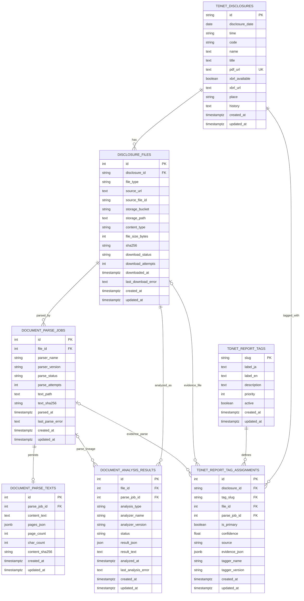

# TDnet Data Model

This project uses PostgreSQL through SQLAlchemy ORM models in `tdnet/orm.py`.
Source PDFs/XBRL files and parser artifacts live on disk under
`TDNET_DOWNLOAD_ROOT`; PostgreSQL stores disclosure metadata, processing state,
searchable text, tags, and analysis lineage.

## Entity Relationship Diagram



## Tables

| Table | Purpose |
| --- | --- |
| `tdnet_disclosures` | One row per scraped TDnet disclosure. The disclosure ID is the stable primary key and `pdf_url` is unique. |
| `disclosure_files` | One row per source artifact type for a disclosure, currently PDF or XBRL. Tracks source URL, expected local path, hash, size, download status, attempts, and errors. |
| `document_parse_jobs` | One row per file and parser identity. Tracks parser name/version, status, attempts, text artifact path, hash, parse time, and errors. |
| `document_parse_texts` | Searchable text cache for completed parse jobs. Stores normalized full text plus page-level JSON used by search/detail views. |
| `document_analysis_results` | Reserved downstream analysis outputs. Keeps analyzer lineage separate from download and parse state. |
| `tdnet_report_tags` | Deterministic report tag taxonomy. |
| `tdnet_report_tag_assignments` | Disclosure-level tag assignments with optional file/parse-job evidence lineage. |

## Key Constraints

- `tdnet_disclosures.pdf_url` is unique.
- `disclosure_files` is unique on `(disclosure_id, file_type)`, so each disclosure has at most one row per source artifact type.
- `document_parse_jobs` is unique on `(file_id, parser_name, parser_version)`, so reruns update or skip the same parser identity instead of creating duplicates.
- `document_parse_texts.parse_job_id` is unique, giving each parse job at most one searchable text cache row.
- `tdnet_report_tag_assignments` is unique on `(disclosure_id, tag_slug)`, so each tag appears at most once per disclosure.

## Processing Lineage

The main ingestion lineage is:

```text
tdnet_disclosures
  -> disclosure_files
  -> document_parse_jobs
  -> document_parse_texts
```

Downstream analysis and tagging keep their own lineage:

```text
document_analysis_results -> disclosure_files, optional document_parse_jobs
tdnet_report_tag_assignments -> tdnet_disclosures, tdnet_report_tags, optional disclosure_files, optional document_parse_jobs
```

This separation lets parser history, searchable text, tagging, and later
business analysis evolve independently.

## Parser Identities

Parser identity is `(parser_name, parser_version)`. Current parser names are:

| Parser name | Source | Command |
| --- | --- | --- |
| `pymupdf4llm` | PDF | `tdnet parse` |
| `apple-vision-ocr` | PDF rendered to page images | `tdnet ocr` |
| `tdnet-ixbrl-text` | downloaded XBRL/iXBRL ZIP sidecar | `tdnet parse-ixbrl` |

The review app lists completed parser options by parser name plus parser
version through `/api/parsers`.

## Disk Artifacts

Large source and parser artifacts are intentionally not stored in PostgreSQL.
`disclosure_files.storage_path` points to downloaded PDFs/XBRL files under
`TDNET_DOWNLOAD_ROOT`, and `document_parse_jobs.text_path` points to the durable
markdown artifact under the disclosure's `parsed/` directory.

Examples:

```text
/Volumes/yakushimachi/Downloads/tdnet/140120260515538453/
  140120260515538453.pdf
  081220260515538453.zip
  parsed/
    pymupdf4llm.<version>.md
    pymupdf4llm.<version>.pages.json
    pymupdf4llm.<version>.meta.json
```

`document_parse_texts` stores a searchable cache of those parsed artifacts, not
the source-of-truth files themselves.
